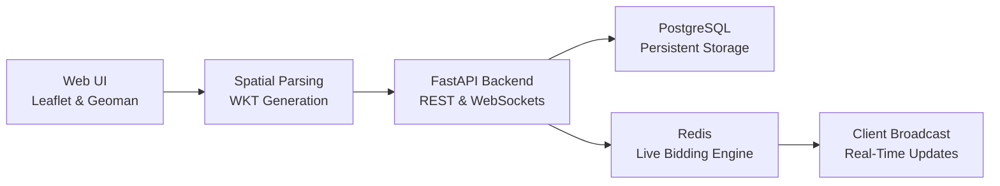

# 🌍 LandAuction

**Real-Time Spatial Land Auction Platform**

LandAuction is an end-to-end full-stack web application designed to revolutionize digital real estate and property bidding. Built with a high-performance Python backend and a lightweight vanilla JavaScript frontend, the platform allows users to dynamically draw spatial property boundaries on an interactive map and instantly launch them into live, countdown-based WebSocket auction rooms.

⚠️ **Disclaimer:** This is a portfolio/research project intended to demonstrate advanced full-stack capabilities, real-time state management, and basic spatial data handling. It is not currently configured to handle real financial transactions.

## ✨ Key Features

| Feature | Description |
| --- | --- |
| **Interactive Spatial Mapping** | Users can draw custom property boundaries (WKT polygons) directly onto OpenStreetMap/Esri tiles using Leaflet and Leaflet-Geoman. |
| **Real-Time Bidding Engine** | Powered by Redis and FastAPI WebSockets, ensuring bids are validated and broadcasted instantly to all connected users with zero page refreshes. |
| **Single Page Application (SPA)** | A seamless, multi-view frontend architecture utilizing vanilla CSS and JavaScript to transition between Auth, Dashboard, and Map states smoothly. |
| **Robust JWT Security** | Secure user registration and login endpoints protected by JSON Web Tokens (JWT) and `bcrypt` password hashing. |
| **Strict Bid Validation** | Algorithmic frontend and backend checks guarantee bids meet minimum floor requirements and legally outbid the current holding price. |
| **Spatial Database Persistence** | Properties and user data are securely persisted in a PostgreSQL database using SQLAlchemy models and raw EWKT geometry handling. |

## 🏗️ Architecture



### Model Workflow

1. **Exploration:** A user logs in and views the interactive map, populated with active auction pins fetched dynamically from the database.
2. **Property Creation:** The user utilizes the spatial polygon tool to draw a property outline. The frontend translates this visual shape into Well-Known Text (WKT).
3. **Initialization:** The backend saves the coordinates to PostgreSQL, calculates the center point for the map pin, and initializes a live auction timer and price key in Redis.
4. **Live Bidding:** Users click a map pin to open a WebSocket connection specifically for that `auction_id`.
5. **Validation & Broadcast:** As bids are placed, the backend verifies the amount against the current Redis state. Valid bids update the Redis cache and instantly broadcast the new price and winner to all active WebSocket listeners.
6. **Expiration:** Once the countdown reaches zero, the frontend visually locks the bidding controls, and the final state is preserved.

## 📂 Project Structure

```text
land-auction-platform/
├── frontend/             
│   └── app.html          # Complete SPA frontend (HTML/CSS/JS + Leaflet)
├── src/                  
│   ├── api/              
│   │   ├── routes/       # FastAPI routers (auth.py, auction.py, bid.py)
│   │   └── security.py   # JWT generation and bcrypt hashing
│   ├── core/             
│   │   └── config.py     # Environment variables and settings
│   ├── db/               
│   │   ├── database.py   # PostgreSQL connection and session management
│   │   └── redis.py      # Redis client initialization and Lua scripts
│   ├── models/           
│   │   ├── auction.py    # SQLAlchemy definitions for Land Parcels
│   │   └── user.py       # SQLAlchemy definitions for Users
│   ├── services/         
│   │   └── websockets.py # WebSocket connection manager
│   └── main.py           # FastAPI application entry point
├── .gitignore            # Git exclusion rules
├── docker-compose.yml    # Infrastructure configuration (Postgres & Redis)
└── README.md             # Project documentation

```

## 🚀 Quick Start

### Prerequisites

* Python 3.9+
* Docker Desktop (for hosting the Postgres and Redis environments)

### Installation

**1. Clone the repository**

```bash
git clone https://github.com/yourusername/land-auction-platform.git
cd land-auction-platform

```

**2. Start the infrastructure**
Ensure Docker is running, then spin up the database containers:

```bash
docker-compose up -d

```

**3. Set up the Python environment**

```bash
python -m venv venv

# Windows:
venv\Scripts\activate
# macOS/Linux:
source venv/bin/activate

```

**4. Install dependencies**

```bash
pip install fastapi uvicorn sqlalchemy asyncpg passlib bcrypt python-jose python-multipart redis pydantic

```

*(Note: A `requirements.txt` file will be added in a future update).*

**5. Run the server**

```bash
uvicorn src.main:app --reload

```

**6. Launch the Application**
Open `frontend/app.html` directly in your favorite modern web browser, or launch it using VS Code's "Live Server" extension.

## 🛠️ Tech Stack

| Component | Technology | Purpose |
| --- | --- | --- |
| **Backend API** | FastAPI (Python) | High-performance asynchronous REST routing and WebSocket handling. |
| **Frontend Map** | Leaflet.js & Geoman | Rendering map tiles (OpenStreetMap/Esri) and enabling spatial drawing tools. |
| **Primary Database** | PostgreSQL | Permanent storage for registered users, property metadata, and spatial coordinates. |
| **Real-Time Engine** | Redis | In-memory datastore for hyper-fast bid processing and auction state tracking. |
| **ORM** | SQLAlchemy | Bridging Python objects to PostgreSQL tables securely. |
| **Security** | Passlib & bcrypt | Cryptographic hashing for user passwords. |
| **Infrastructure** | Docker | Containerizing the databases for seamless local development. |

## 🔮 Roadmap & Future Improvements

* [ ] **Virtual Wallets:** Implement a digital currency system where users must deposit funds before placing bids.
* [ ] **Dockerized Server:** Package the FastAPI application into a Docker container alongside the databases for a single-command deployment.
* [ ] **User Dashboard:** Add a dedicated profile screen for users to track the properties they have created and the auctions they have won.
* [ ] **Dependency Tracking:** Generate and track a formal `requirements.txt` or `Pipfile`.

## 📜 License

This project is licensed under the MIT License - see the LICENSE file for details.